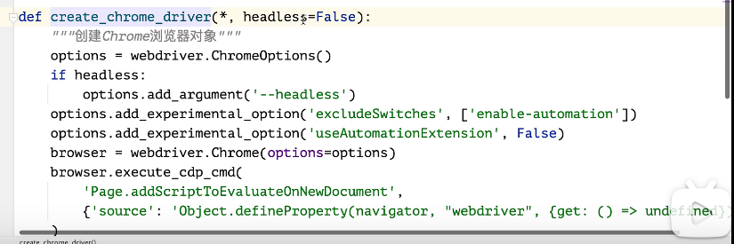

### 安装Scrapy
1. 设置镜像源 `https://pypi.tuna.tsinghua.edu.cn/simple` `https://pypi.org/simple`
2. 执行安装命令 `pip install scrapy`

### 常用命令行
```shell
# 创建项目
$ scrapy startproject <project_name> [project_dir]
# 创建蜘蛛
$ scrapy genspider [-t template] <name> <domain>
$ scrapy genspider -l
# 执行蜘蛛
$ scrapy crawl <spider> # 需要项目
$ scrapy runspider <spider_file.py> # 不需要项目
$ scrapy crawl <spider> -o xxx.csv
# 查询当前项目蜘蛛
$ scrapy list
# 校验请求
$ scrapy fetch <url>
$ scrapy view <url>
# 交互式操作
$ scrapy shell [url]
```

### Selenium反爬设置


### 参考资料
- [Scrapy官网](https://scrapy.org/?msclkid=2b7eea76c3d111ecb58e5a0287dc9ba3)
- [Scrapy中文文档](https://www.osgeo.cn/scrapy/index.html)
- [Scrapy英文文档](https://docs.scrapy.org/en/latest/)
- [re --- 正则表达式操作](https://docs.python.org/zh-cn/3/library/re.html)
- [pprint --- 数据美化输出](https://docs.python.org/zh-cn/3/library/pprint.html)
- [Faker --- Python构造数据的神器库](https://faker.readthedocs.io/en/master/)
- [Requests --- 让 HTTP 服务人类](https://docs.python-requests.org/zh_CN/latest/)
- [Scrapy初级视频教程](https://www.bilibili.com/video/BV1QY411F7Vt?p=9&vd_source=ebdead56fe1dd3f886aa4b83e7fe13cb)
- [UserAgent 在线工具](https://useragent.buyaocha.com/)
- [使用Playwright绕过Webdriver检测](https://blog.csdn.net/m0_54853503/article/details/123054979)
